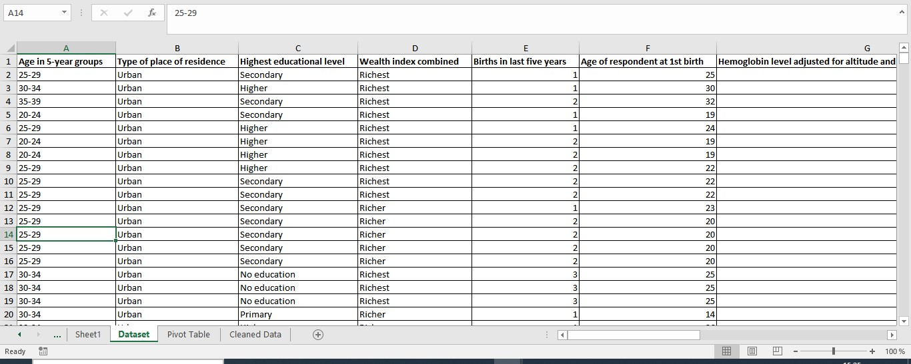
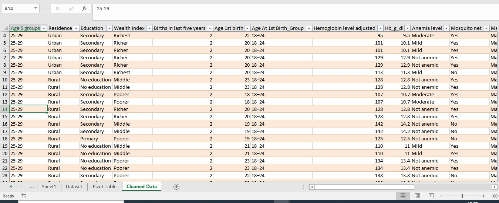

# -Anaemia-Health-Data-Analysis

# 📖Introduction
Anaemia is a persistent public health concern with serious consequences for women and children. It weakens immunity, reduces productivity, increases the risk of maternal and perinatal mortality, and slows socioeconomic development. In low-resource settings, anaemia is often caused by poor nutrition, malaria, early pregnancies, and inequities in access to healthcare and education.
This analysis was carried out using anaemia-related health data, focusing on key determinants such as age at first birth, education level, mosquito-net usage, haemoglobin levels, residence, and wealth index. The results aim to guide health-sector decision-making and program design.

## Dataset Overview

This project analyzes anaemia-related health data with a focus on demographic and socioeconomic determinants. The dataset was visualized through a dashboard and explored across multiple indicators, including:

- Age at first birth

- Education level

- Mosquito-net usage

- Haemoglobin levels by age group

- Residence (rural vs urban)

- Wealth index

The aim is to generate health-sector insights that can inform decision-making, resource allocation, and intervention strategies.

# 🎯 Objectives

-	Assess the distribution of anaemia across demographic and socioeconomic groups.

-	Identify factors associated with higher anaemia burden (education, wealth, rural residence, early pregnancies).

-	Highlight high-risk groups most affected by anaemia.

-	Provide actionable recommendations for health-sector programs.

## 🔬 Data Analysis Stages

-	Data Collection – extracted anaemia-related survey indicators and aggregated counts.

-	Data Cleaning – ensured completeness, categorized haemoglobin levels, standardized socioeconomic groupings.

-	Exploration – generated descriptive summaries and cross-tabulations.

-	Visualization – created a dashboard with charts showing disparities across groups.

-	Interpretation – identified vulnerable populations and health-sector implications.

# 📊 Key Findings

- Early pregnancies (<24 years) strongly associated with anaemia.

- No education → highest anaemia cases; higher education → lowest.

- Rural women (1,694 cases) had >2× anaemia compared to urban women (745 cases).

- Poorest households had the greatest burden; richest households had minimal cases.

- Anaemia concentrated among reproductive-age women (20–34 years).

- Mosquito-net users had higher recorded cases, reflecting distribution in malaria-prone areas.

# 🩺 Health-Sector Recommendations

- Adolescents & young mothers → expand reproductive health education, family planning, and iron supplementation.

- Rural populations → strengthen outreach services, supply diagnostic kits and supplements.

- Poverty & nutrition → implement food fortification, provide nutrition support programs.

- Malaria integration → couple mosquito-net distribution with anaemia screening and preventive treatment.

- Education & awareness → promote nutrition literacy and dietary practices that improve iron intake.

# 📌 Conclusion

Anaemia disproportionately affects young mothers, women with no education, rural residents, and the poorest households. Tackling this challenge requires integrated health-sector strategies that combine nutrition interventions, reproductive health services, malaria control, and socioeconomic support.

